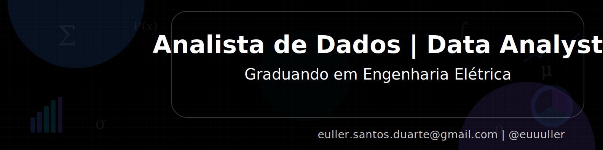
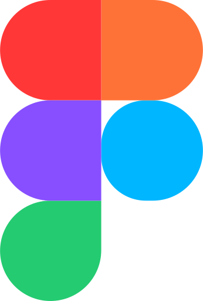

  

---

Sou graduando em <strong>Engenharia Elétrica</strong> pelo Instituto Federal do Maranhão (IFMA), com foco em <strong>Análise de Dados</strong> e tomada de decisão orientada a dados. Possuo experiência prática com Excel, Power BI, SQL e Python, aplicando conceitos de Estatística e os principais tipos de análise de dados Descritiva, Diagnóstica, Preditiva e Prescritiva para resolver problemas de negócio. Desenvolvi projetos completos utilizando dados públicos, incluindo segmentação de clientes (RFM), análise de retenção por cohort, diagnóstico de queda de vendas, criação de dashboards gerenciais e previsão do número de pedidos, transformando dados brutos em insights acionáveis.

Busco uma oportunidade de Estágio como <strong>Analista de Dados</strong>, onde eu possa contribuir com análises claras, métricas relevantes e soluções orientadas a dados para apoiar decisões estratégicas nas organizações, sempre com ênfase no pensamento crítico e na resolução de problemas.

 

---

&nbsp;&nbsp;&nbsp;

&nbsp;&nbsp;&nbsp;

&nbsp;&nbsp;&nbsp;

&nbsp;&nbsp;&nbsp;

&nbsp;&nbsp;&nbsp;

&nbsp;&nbsp;&nbsp;

&nbsp;&nbsp;&nbsp;

&nbsp;&nbsp;&nbsp;

&nbsp;&nbsp;&nbsp;

&nbsp;&nbsp;&nbsp;

&nbsp;&nbsp;&nbsp;

&nbsp;&nbsp;&nbsp;

&nbsp;&nbsp;&nbsp;

&nbsp;&nbsp;&nbsp;

---

